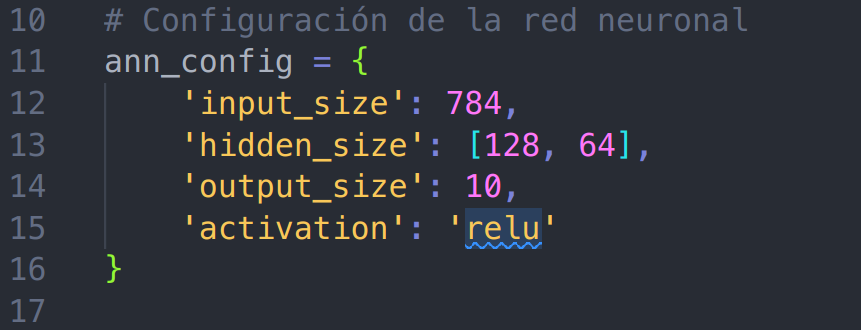

# Proyecto 1: Redes Neuronales Artificiales y SVM

Este proyecto tiene como objetivo utilizar redes neuronales y máquinas
de soporte vectorial para clasificar dígitos escritos a mano del conjunto
de datos MNIST. Se aplicarán técnicas de aumento de datos para robustecer
los procesos de entrenamiento y la capacidad de generalización de los
modelos. Además, se realizará un proceso de selección de modelos para
optimizar métricas de clasificación.

## Dependencias

- Python 3.x
- Bibliotecas: PyTorch, Scikit-Learn, Matplotlib, NumPy, Jupyter, Pillow
- Cuenta en Weights & Biases (para el seguimiento de experimentos)

### PyTorch

Puedes instalar PyTorch con soporte para CPU o GPU. Si tienes CUDA y
una GPU de NVIDIA, puedes instalar PyTorch con soporte para GPU. De
lo contrario, tendrás que instalar PyTorch con soporte para CPU.

#### CPU

```bash
micromamba install pytorch torchvision \
          torchaudio cpuonly -c pytorch
```

#### GPU

```bash
micromamba  install pytorch torchvision \
            torchaudio pytorch-cuda=12.1\
            -c pytorch -c nvidia
```

### Other dependencies

```bash
micromamba install matplotlib numpy \
                    scikit-learn jupyter pillow \
                    joblib \
                    tqdm \
                    wandb
```

## Estructura del proyecto

- `softmax.py`: Ejemplo de clasificador softmax.
- `train_softmax.py`: Script para entrenar el clasificador softmax.
- `test_softmax.py`: Script para evaluar el clasificador softmax.
- `ann.py`: Modelo de red neuronal artificial.
- `train_ann.py`: Script para entrenar la red neuronal.
- `test_ann.py`: Script para evaluar la red neuronal con los datos de MNIST.
- `test_ann_data_group.py`: Script para evaluar la red neuronal con los datos de grupo.
- `optimize_ann.py`: Script para optimizar los hiperparámetros de la
  red neuronal.
- `pareto_ann.py`: Script para mostrar los resultados de la optimización de los
  hiperparámetros de la ANN.
- `svm.py`: Modelo de máquina de soporte vectorial.
- `train_svm.py`: Script para entrenar la SVM.
- `test_svm.py`: Script para evaluar la SVM con los datos de MNIST.
- `test_svm_data_group.py`: Script para evaluar la SVM con los datos de grupo.
- `optimize_svm.py`: Script para optimizar los hiperparámetros de la SVM.
- `pareto_svm.py`: Script para mostrar los resultados de la optimización de los
  hiperparámetros de la SVM.
- `predict.py`: Script para realizar predicciones en vivo utilizando los modelos entrenados.
- `digitpainter.py`: Aplicación para dibujar dígitos y probar los modelos.

## Uso

### Uso para el Digit Painter

1. Ejecutar los scripts de entrenamiento (`train_softmax.py`, `train_ann.py`, `train_svm.py`) para entrenar los modelos.

   - Para modificar los hiperparámetros del SVM modifique el diccionario de entrada.

   

   Nota: Los parámetros de entrada son:

   | Parámetro | Tipo     | Descripción                                                                          | Valores                 |
   | --------- | -------- | ------------------------------------------------------------------------------------ | ----------------------- |
   | `file`    | `string` | Si se desea cargar un modelo, pasar el path donde se encuentra el archivo del model. | -                       |
   | `C`       | `float`  | Escoge el valor de C del SVM.                                                        | 1 a 500                 |
   | `kernel`  | `string` | Escoge el kernel.                                                                    | "linear", "rbf", "poly" |
   | `gamma`   | `float`  | Escoge el gamma. Solo para la opción del kernel de "rbf".                            | 1e-6 a 1e2              |
   | `degree`  | `int`    | Escoge el grado del polinomio. Solo para la opción del kernel de "poly".             | 1 a 5                   |

   - Para modificar los hiperparámetros del ANN modifique el diccionario de entrada.

   

   Nota: Los parámetros de entrada son:

| Parámetro     | Tipo     | Descripción                                                                                                                       |
| ------------- | -------- | --------------------------------------------------------------------------------------------------------------------------------- |
| `input_size`  | `int`    | Tamaño de la capa de entrada.                                                                                                     |
| `hidden_size` | `list`   | Lista con los tamaños de las capas ocultas.                                                                                       |
| `output_size` | `int`    | Tamaño de la capa de salida.                                                                                                      |
| `activation`  | `string` | Función de activación a utilizar en las capas ocultas. Pude usar `ReLU`, `sigmoid`, `PreLU`, `ELU`, `LeakyReLU`, `SELU` o `tanh`. |
| `optim`       | `string` | Optimizador a utilizar. Pude usar `Adam`, `Nadam` o `SGD`                                                                         |
| `filename`    | `string` | Nombre del archivo para cargar un modelo pre-entrenado.                                                                           |

1. Ejecutar los scripts de evaluación (`test_softmax.py`, `test_ann.py`, `test_svm.py`) para evaluar el desempeño de los modelos con los datos de MNIST.
1. Ejecutar los scripts de evaluación (`test_ann_data_group.py`, `test_svm_data_group.py`) para evaluar el desempeño de los modelos con datos de grupo.
1. Ejecutar `predict.py` para realizar predicciones en vivo utilizando la aplicación `digitpainter.py`.

### Uso con optimización de hiperparámetros

1. Ejecutar los scripts de optimización (`optimize_ann.py`, `optimize_svm.py`), estos scripts requieren un alto valor computacional por lo que se recomienda el uso de
   [Google Colab](https://colab.research.google.com/) para realizar la optimización.
1. Ejecutar los scripts de pareto (`pareto_ann.py`, `pareto_svm.py`) para mostrar los resultados de la optimización de los hiperparámetros, y obtener la mejor combinación de hiperparámetros.

## Resultados

Los resultados obtenidos, incluyendo gráficas, matrices de confusión y análisis, se encuentran en el archivo PDF adjunto en `docs/solution.pdf`. Presione el siguiente
[link](docs/solution.pdf) para ver el archivo.

## Integrantes

- **David Badilla Marin**
- **Lizzy González Alvarado**
- **Ignacio Grané Rojas**
- **Carlos Andrés Mata Calderón**

## Nota

Este proyecto fue desarrollado como parte del curso de Aprendizaje Automático en el Instituto Tecnológico de Costa Rica.

## Los Datos Grupales

Isaac un compañero del curso creo un repositorio donde pudimos subir nuestras
imágenes de dígitos escritos a mano. El repositorio se encuentra en
<https://github.com/GChacon8/DigitPainter>

En el apartado Release, se encuentra el archivo `Data.Numpy.tar.gz`, para el
caso de cargar los datos a un arreglo de Numpy. Este es el archivo que usa en
el SVM se extrae el archivo y se pone los archivos .npy en la carpeta `data`,
para extraer los datos del los compañeros.

En el apartado Release, se encuentra el archivo `Data.torch.tar.gz`, para el
caso de cargar los datos a Torch. Este es el archivo que usa en
el ANN se extrae el archivo y se pone los archivos `data`,
para extraer los datos del los compañeros.
